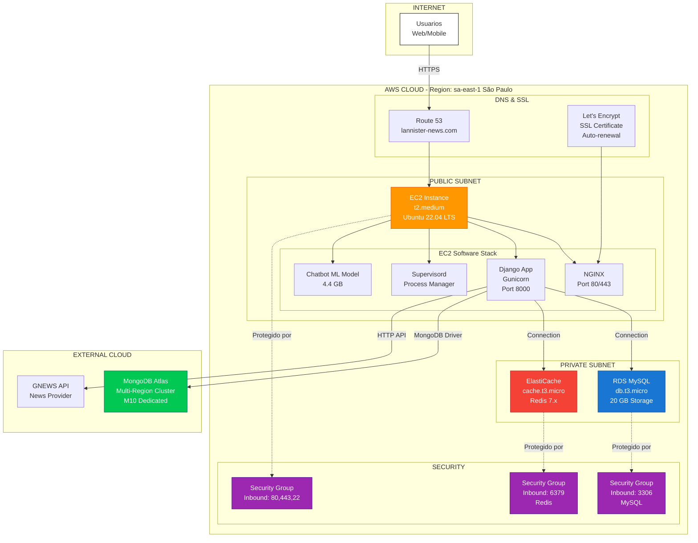
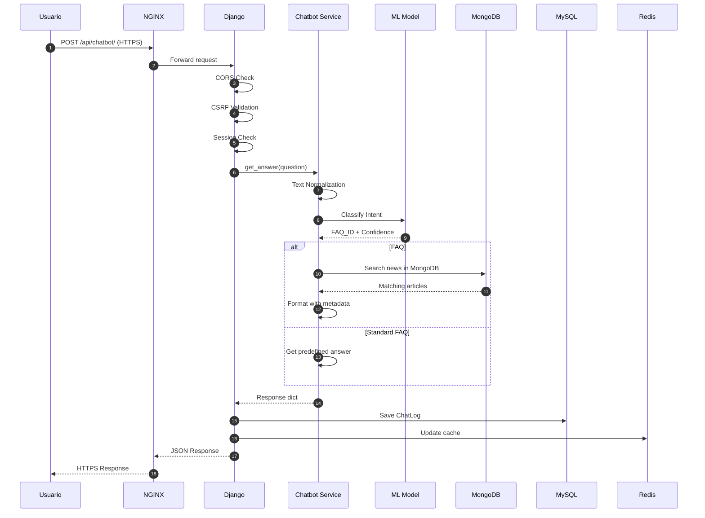
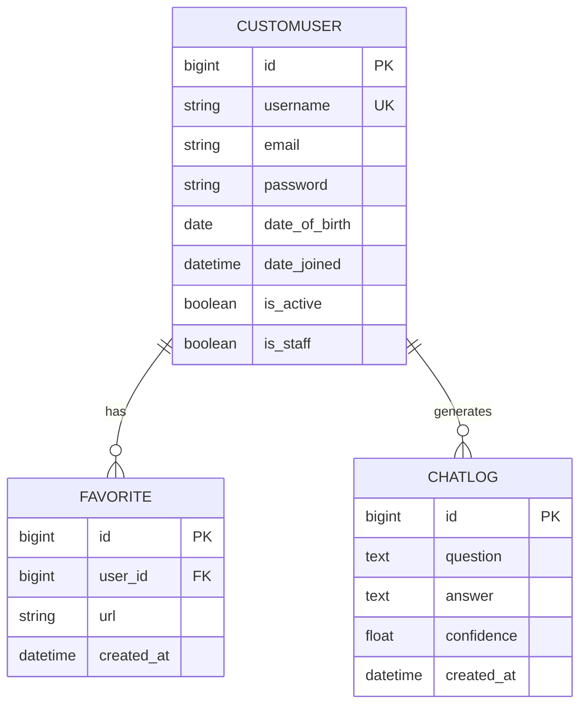

# 🏛️ Arquitectura General - Lannister News Backend

**Sistema:** Lannister News API  
**Fecha:** 26 de octubre de 2025  
**Versión:** 2.0

---

## 📐 Arquitectura en Capas

```mermaid
flowchart TB
    subgraph "PRESENTACIÓN"
        A1[React Frontend<br/>Web/Mobile]
        A2[Postman/API Clients<br/>Testing]
    end
    
    subgraph "GATEWAY"
        B1[NGINX<br/>Reverse Proxy<br/>SSL/TLS Termination]
    end
    
    subgraph "APLICACIÓN"
        direction TB
        C1[Django WSGI<br/>Gunicorn]
        C2[Middleware Stack<br/>CORS | Security | Session | CSRF]
        C3[URL Routing<br/>lannister_news_api/urls.py]
        
        subgraph "MÓDULOS"
            direction LR
            D1[📰 News<br/>Module]
            D2[🤖 Chatbot<br/>Module]
            D3[👥 Users<br/>Module]
        end
        
        C1 --> C2
        C2 --> C3
        C3 --> D1 & D2 & D3
    end
    
    subgraph "SERVICIOS"
        E1[News Service<br/>Scraping & Repository]
        E2[Chatbot Service<br/>ML + FAQ + Search]
        E3[Auth Service<br/>Login/Logout/CSRF]
        
        D1 --> E1
        D2 --> E2
        D3 --> E3
    end
    
    subgraph "PERSISTENCIA"
        F1[(MySQL<br/>AWS RDS<br/>Users/Sessions)]
        F2[(MongoDB<br/>Atlas<br/>News)]
        F3[(Redis<br/>ElastiCache<br/>Cache/Sessions)]
        
        E1 --> F2
        E2 --> F2 & F1
        E3 --> F1 & F3
    end
    
    subgraph "EXTERNOS"
        G1[GNEWS API<br/>News Source]
        G2[HuggingFace<br/>ML Model<br/>DistilBERT]
        
        E1 -.->|Scraping| G1
        E2 -.->|Inference| G2
    end
    
    A1 & A2 --> B1
    B1 --> C1
    
    style A1 fill:#e1f5ff,stroke:#01579b
    style B1 fill:#f3e5f5,stroke:#4a148c
    style C1 fill:#092e20,stroke:#0c4b33,color:#fff
    style D1 fill:#1976d2,color:#fff
    style D2 fill:#388e3c,color:#fff
    style D3 fill:#f57c00,color:#fff
    style F1 fill:#d32f2f,color:#fff
    style F2 fill:#00796b,color:#fff
    style F3 fill:#c62828,color:#fff
```

---

## 🌐 Diagrama de Despliegue AWS



---

## 🔄 Flujo de Datos Completo



---

## 📊 Arquitectura de Datos

### **Modelo de Datos Relacional (MySQL)**



### **Modelo de Datos NoSQL (MongoDB)**

```javascript
// Collection: news
{
  _id: ObjectId("..."),
  title: "Título de la noticia",
  description: "Descripción completa...",
  url: "https://source.com/article", // unique
  source_domain: "eltiempo.com",
  category: "Deportes", // Enum: [Deportes, Judiciales, Moda, Tecnología, Animales]
  image: "https://cdn.com/image.jpg",
  date_publish: "2025-10-26T10:30:00Z", // ISO String
  scraped_at: ISODate("2025-10-26T11:00:00Z") // DateTime
}

// Collection: scraping_metadata
{
  _id: ObjectId("..."),
  key: "last_scrape_time", // unique
  value: ISODate("2025-10-26T11:00:00Z"),
  updated_at: ISODate("2025-10-26T11:00:00Z")
}
```

---

## 🎯 Decisiones Arquitectónicas Clave

### **1. Base de Datos Híbrida (SQL + NoSQL)**

**Decisión:** Usar MySQL para datos relacionales y MongoDB para noticias

**Razones:**
- ✅ **MySQL (RDS):** Perfecto para users, sessions, relaciones FK
- ✅ **MongoDB (Atlas):** Ideal para noticias (schema flexible, alto volumen)
- ✅ **Escalabilidad:** Cada DB escala independientemente
- ✅ **Performance:** MongoDB optimizado para reads masivos de noticias

**Trade-offs:**
- ❌ Complejidad: Mantener 2 sistemas de BD
- ❌ Transacciones distribuidas no son posibles
- ✅ Ventaja: Cada DB usa su fortaleza (ACID vs Document Store)

---

### **2. Chatbot con ML Local (No API Externa)**

**Decisión:** Modelo HuggingFace alojado en EC2, no usar OpenAI/GPT

**Razones:**
- ✅ **Costo:** Sin cobro por token/request
- ✅ **Privacidad:** Datos no salen del servidor
- ✅ **Latencia:** Inferencia local < 500ms
- ✅ **Control:** Modelo entrenado específicamente para FAQs

**Trade-offs:**
- ❌ Tamaño: 4.4 GB en disco (considerar Git LFS)
- ❌ Recursos: Requiere CPU/RAM para inferencia
- ✅ Ventaja: Predecible y confiable (no depende de APIs externas)

---

### **3. Redis como Session Backend**

**Decisión:** Sessions en Redis (ElastiCache) con fallback a MySQL

**Razones:**
- ✅ **Performance:** In-memory > Disk reads
- ✅ **Escalabilidad:** Redis maneja millones de sessions
- ✅ **Expiration:** TTL automático (7 días)
- ✅ **Availability:** AWS ElastiCache con replicación

**Configuración:**
```python
SESSION_ENGINE = "django.contrib.sessions.backends.cached_db"
# cached_db = Intenta Redis primero, fallback a MySQL si falla
```

---

### **4. Monolito Modular vs Microservicios**

**Decisión:** Monolito modular con Django (no microservicios)

**Razones:**
- ✅ **Simplicidad:** Más fácil de desarrollar/desplegar/debuggear
- ✅ **Performance:** Sin latencia de red entre módulos
- ✅ **Costo:** 1 EC2 instance vs múltiples containers
- ✅ **Escala:** Suficiente para tráfico actual

**Preparado para Microservicios:**
- ✅ Módulos independientes (`news/`, `chatbot/`, `users/`)
- ✅ Repository pattern desacopla lógica de BD
- ✅ Factory pattern facilita extracción futura

---

### **5. NGINX como Reverse Proxy**

**Decisión:** NGINX delante de Gunicorn/Django

**Razones:**
- ✅ **SSL/TLS Termination:** Let's Encrypt integrado
- ✅ **Static Files:** Sirve archivos estáticos directamente
- ✅ **Load Balancing:** Distribuye carga entre workers
- ✅ **Compression:** Gzip automático
- ✅ **Security:** Headers de seguridad (HSTS, X-Frame-Options)

**Stack:**
```
Internet → NGINX:443 → Gunicorn:8000 → Django WSGI
```

---

## 🔐 Consideraciones de Seguridad

### **Implementado:**

1. **HTTPS Everywhere:**
   - Let's Encrypt con auto-renovación
   - Redirect HTTP → HTTPS

2. **CSRF Protection:**
   - Django CSRF middleware activo
   - Tokens por sesión

3. **CORS Configurado:**
   ```python
   CORS_ALLOWED_ORIGINS = [
       "https://lannister-news.com",
       "https://app.lannister-news.com"
   ]
   ```

4. **Secrets Management:**
   - Variables de entorno (`.env`)
   - AWS Secrets Manager para producción
   - Fail-fast si SECRET_KEY falta

5. **Database Security:**
   - RDS en subnet privada (no acceso público)
   - Security Groups restrictivos
   - Passwords fuertes rotados

6. **Session Security:**
   ```python
   SESSION_COOKIE_SECURE = True
   SESSION_COOKIE_HTTPONLY = True
   SESSION_COOKIE_SAMESITE = 'None'
   ```

### **Por Implementar:**

- 🔄 WAF (Web Application Firewall)
- 🔄 DDoS protection (AWS Shield)
- 🔄 Audit logging centralizado
- 🔄 MFA para usuarios admin

---

## 📈 Estrategia de Escalabilidad

### **Vertical Scaling (Corto Plazo):**
- Aumentar tamaño de EC2 (t2.medium → t2.large)
- Más workers de Gunicorn
- Más RAM para modelo ML

### **Horizontal Scaling (Largo Plazo):**
```
                    [Load Balancer]
                    /      |      \
              [EC2-1]  [EC2-2]  [EC2-3]
                    \      |      /
                    [RDS Master-Replica]
                    [ElastiCache Cluster]
                    [MongoDB Sharded Cluster]
```

### **Cache Strategy:**
- **Level 1:** Redis (sessions, hot data)
- **Level 2:** Django cache framework (query results)
- **Level 3:** NGINX cache (static assets)

---

## 🧪 Testing & CI/CD

### **Testing Pyramid:**
```
                  /\
                 /  \  E2E Tests (Postman Collections)
                /----\
               /      \ Integration Tests (Django TestCase)
              /--------\
             /          \ Unit Tests (pytest, services)
            /------------\
```

### **CI/CD Pipeline (Propuesto):**
```
GitHub Push → GitHub Actions → Run Tests → Build → Deploy to EC2
    ↓
SonarQube Analysis → Security Scan → Code Quality Gate
    ↓
Pass → Auto Deploy to Production
Fail → Notify Team
```

---

## 📊 Monitoreo y Observabilidad

### **Logs:**
- **Application Logs:** Django logging
- **Access Logs:** NGINX access.log
- **Error Logs:** NGINX error.log, Django errors
- **Scraper Logs:** `aws-deployment-scripts/deployment-logs/`

### **Métricas (AWS CloudWatch):**
- CPU Utilization (EC2)
- Memory Utilization
- Disk I/O
- Network Traffic
- RDS Connections
- ElastiCache Hit Rate

### **Alertas:**
- CPU > 80% por 5 minutos
- Disk > 90% usage
- HTTP 5xx errors > 10/min
- RDS connections > 80%

---

## 🛠️ Stack Tecnológico Completo

| Layer | Technology | Purpose |
|-------|------------|---------|
| **Frontend** | React | UI/UX |
| **Gateway** | NGINX | Reverse Proxy, SSL |
| **Backend** | Django 5.2.5 | API Framework |
| **API** | Django REST Framework | REST API |
| **WSGI** | Gunicorn | Application Server |
| **Process Mgmt** | Supervisord | Auto-restart |
| **Language** | Python 3.12+ | Programming |
| **SQL DB** | MySQL 8.0 (RDS) | Relational Data |
| **NoSQL DB** | MongoDB 7.0 (Atlas) | Document Store |
| **Cache** | Redis 7.x (ElastiCache) | In-memory Cache |
| **ML Framework** | HuggingFace Transformers | NLP |
| **ML Model** | DistilBERT | Text Classification |
| **SSL/TLS** | Let's Encrypt | HTTPS |
| **Cloud** | AWS (EC2, RDS, ElastiCache) | Infrastructure |
| **OS** | Ubuntu 22.04 LTS | Operating System |

---

## 📝 Referencias Útiles

1. **Component Diagram:** `docs/architecture/COMPONENT_DIAGRAM.md`
2. **API Documentation:** `docs/api/API_Documentation.md`
3. **Deployment Guide:** `docs/deployment/DEPLOY_AWS_GUIDE.md`
4. **Security Guide:** `docs/security/SECRETS_MANAGEMENT.md`
5. **Testing Guide:** `docs/testing/POSTMAN_TESTING_GUIDE.md`

---

**Última Actualización:** 26 de octubre de 2025  
**Responsable:** HouseLannisterDev Team  
**Estado:** ✅ En Producción
