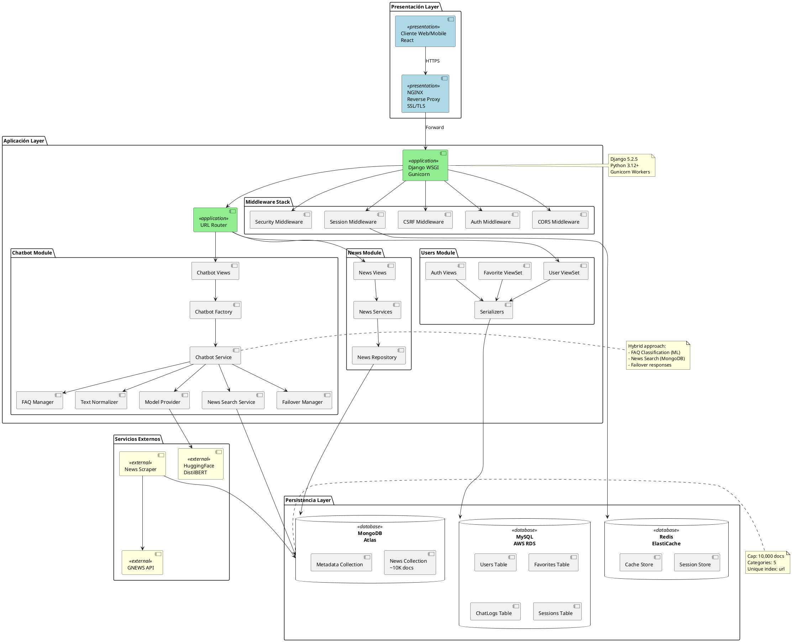

# 🎨 Formatos Exportables - Diagramas de Componentes

Este archivo contiene el diagrama de componentes de Lannister Backend en diferentes formatos para usar en herramientas externas.

---

## 📋 Tabla de Contenidos

1. [PlantUML (.puml)](#plantuml-puml)
2. [C4 Model (.dsl)](#c4-model-dsl)
3. [D2 Lang (.d2)](#d2-lang-d2)
4. [Structurizr (.json)](#structurizr-json)
5. [Draw.io (.drawio.xml)](#drawio-drawiodrawioxml)

---

## 1. PlantUML (.puml)

**Herramienta:** [PlantUML](https://plantuml.com/)  
**Instalación:** `brew install plantuml` o usar [PlantUML Online](http://www.plantuml.com/plantuml/)



**Uso:**
```bash
# Generar PNG
plantuml lannister_components.puml

# O usar online
# Copiar y pegar en http://www.plantuml.com/plantuml/
```

---

## 2. C4 Model (.dsl)

**Herramienta:** [Structurizr DSL](https://structurizr.com/)  
**Viewer:** [Structurizr Lite](https://structurizr.com/help/lite)

```c4
workspace "Lannister News Backend" "Arquitectura del sistema de noticias" {

    model {
        # Actores
        user = person "Usuario" "Usuario de la aplicación web/mobile"
        
        # Sistemas Externos
        gnews = softwareSystem "GNEWS API" "API externa de noticias" "External"
        huggingface = softwareSystem "HuggingFace" "Modelo ML DistilBERT" "External"
        
        # Sistema Principal
        lannisterBackend = softwareSystem "Lannister Backend" "API REST para gestión de noticias, usuarios y chatbot" {
            
            # Contenedores
            nginx = container "NGINX" "Reverse Proxy" "NGINX" "Gateway" {
                tags "Infrastructure"
            }
            
            djangoApp = container "Django Application" "API REST" "Django 5.2.5, Python 3.12" {
                
                # Componentes
                router = component "URL Router" "Enrutamiento de peticiones" "Django URLs"
                middleware = component "Middleware Stack" "CORS, CSRF, Sessions, Auth" "Django Middleware"
                
                # News Module
                newsViews = component "News Views" "Endpoints de noticias" "Django Views"
                newsService = component "News Service" "Lógica de negocio noticias" "Python"
                newsRepo = component "News Repository" "Acceso a datos noticias" "PyMongo"
                
                # Chatbot Module
                chatbotViews = component "Chatbot Views" "Endpoints chatbot" "Django Views"
                chatbotFactory = component "Chatbot Factory" "Creación de servicio chatbot" "Factory Pattern"
                chatbotService = component "Chatbot Service" "Lógica ML + Búsqueda" "Python"
                faqManager = component "FAQ Manager" "Gestión de FAQs" "Python"
                modelProvider = component "Model Provider" "Proveedor ML Model" "Singleton Pattern"
                newsSearchService = component "News Search Service" "Búsqueda de noticias" "Python"
                
                # Users Module
                userViews = component "User Views" "Endpoints usuarios" "Django ViewSet"
                authViews = component "Auth Views" "Autenticación" "Django REST"
                serializers = component "Serializers" "Serialización datos" "DRF Serializers"
                
                # Relaciones internas
                router -> newsViews "Enruta"
                router -> chatbotViews "Enruta"
                router -> userViews "Enruta"
                router -> authViews "Enruta"
                
                newsViews -> newsService "Usa"
                newsService -> newsRepo "Usa"
                
                chatbotViews -> chatbotFactory "Crea"
                chatbotFactory -> chatbotService "Instancia"
                chatbotService -> faqManager "Consulta"
                chatbotService -> modelProvider "Clasifica"
                chatbotService -> newsSearchService "Busca"
                newsSearchService -> newsRepo "Consulta"
                
                userViews -> serializers "Serializa"
                authViews -> serializers "Serializa"
            }
            
            mysqlDB = container "MySQL Database" "Datos relacionales" "MySQL 8.0 (AWS RDS)" "Database"
            mongoDB = container "MongoDB" "Noticias y metadata" "MongoDB Atlas" "Database"
            redis = container "Redis Cache" "Sesiones y cache" "Redis 7.x (ElastiCache)" "Cache"
            
            scraper = container "News Scraper" "Scraping automatizado" "Python Script"
            
            # Relaciones entre contenedores
            nginx -> djangoApp "Forward HTTPS" "HTTPS"
            
            djangoApp -> mysqlDB "Lee/Escribe" "MySQL Protocol"
            djangoApp -> mongoDB "Lee/Escribe" "MongoDB Protocol"
            djangoApp -> redis "Cache/Sessions" "Redis Protocol"
            
            newsRepo -> mongoDB "Query"
            serializers -> mysqlDB "ORM"
            middleware -> redis "Sessions"
            
            modelProvider -> huggingface "Carga modelo"
            scraper -> gnews "Fetch articles" "HTTPS/REST"
            scraper -> mongoDB "Inserta noticias"
        }
        
        # Relaciones de usuario
        user -> nginx "Usa" "HTTPS"
        
        # Tags
        tags "Backend"
    }

    views {
        systemContext lannisterBackend "SystemContext" {
            include *
            autoLayout
        }
        
        container lannisterBackend "Containers" {
            include *
            autoLayout
        }
        
        component djangoApp "Components" {
            include *
            autoLayout
        }
        
        styles {
            element "Software System" {
                background #1168bd
                color #ffffff
            }
            element "External" {
                background #999999
                color #ffffff
            }
            element "Container" {
                background #438dd5
                color #ffffff
            }
            element "Component" {
                background #85bbf0
                color #000000
            }
            element "Database" {
                shape Cylinder
                background #ff6b6b
                color #ffffff
            }
            element "Cache" {
                shape Cylinder
                background #51cf66
                color #ffffff
            }
            element "Infrastructure" {
                background #f59f00
                color #ffffff
            }
        }
    }
}
```

**Uso:**
```bash
# Instalar Structurizr Lite
docker run -it --rm -p 8080:8080 -v $(pwd):/usr/local/structurizr structurizr/lite

# Abrir http://localhost:8080
# Pegar el código en workspace.dsl
```

---

## 3. D2 Lang (.d2)

**Herramienta:** [D2 - Declarative Diagramming](https://d2lang.com/)  
**Instalación:** `brew install d2` o [Online Playground](https://play.d2lang.com/)

```d2
title: {
  label: Lannister News Backend - Component Diagram
  near: top-center
}

direction: down

# Presentación Layer
presentation: Presentación Layer {
  client: Cliente Web/Mobile\nReact {
    shape: rectangle
    style.fill: "#e1f5ff"
    style.stroke: "#01579b"
  }
  
  nginx: NGINX\nReverse Proxy\nSSL/TLS {
    shape: rectangle
    style.fill: "#f3e5f5"
    style.stroke: "#4a148c"
  }
}

# Aplicación Layer
application: Aplicación Layer {
  django: Django WSGI\nGunicorn {
    style.fill: "#092e20"
    style.stroke: "#0c4b33"
    style.font-color: "#ffffff"
  }
  
  router: URL Router {
    style.fill: "#c8e6c9"
  }
  
  middleware: Middleware Stack {
    cors: CORS
    security: Security
    session: Session
    csrf: CSRF
    auth: Auth
  }
  
  news: News Module {
    style.fill: "#bbdefb"
    
    views: News Views
    services: News Services
    repository: News Repository
  }
  
  chatbot: Chatbot Module {
    style.fill: "#c8e6c9"
    
    views: Chatbot Views
    factory: Chatbot Factory
    service: Chatbot Service {
      faq: FAQ Manager
      normalizer: Text Normalizer
      model: Model Provider
      search: News Search
      failover: Failover Manager
    }
  }
  
  users: Users Module {
    style.fill: "#ffe0b2"
    
    userViews: User ViewSet
    favViews: Favorite ViewSet
    authViews: Auth Views
    serializers: Serializers
  }
}

# Persistencia Layer
persistence: Persistencia Layer {
  mysql: MySQL\nAWS RDS {
    shape: cylinder
    style.fill: "#ff6b6b"
    style.font-color: "#ffffff"
    
    users: Users Table
    favorites: Favorites Table
    chatlogs: ChatLogs Table
    sessions: Sessions Table
  }
  
  mongodb: MongoDB\nAtlas {
    shape: cylinder
    style.fill: "#00796b"
    style.font-color: "#ffffff"
    
    news: News Collection\n~10K docs
    metadata: Metadata Collection
  }
  
  redis: Redis\nElastiCache {
    shape: cylinder
    style.fill: "#c62828"
    style.font-color: "#ffffff"
    
    sessionStore: Session Store
    cacheStore: Cache Store
  }
}

# Externos
external: Servicios Externos {
  style.fill: "#fff9c4"
  
  gnews: GNEWS API {
    shape: cloud
    style.fill: "#ffd54f"
  }
  
  huggingface: HuggingFace\nDistilBERT {
    shape: cloud
    style.fill: "#ffd54f"
  }
  
  scraper: News Scraper {
    style.fill: "#ff9800"
    style.font-color: "#ffffff"
  }
}

# Conexiones - Presentación
presentation.client -> presentation.nginx: HTTPS {
  style.stroke: "#1976d2"
  style.stroke-width: 2
}

presentation.nginx -> application.django: Forward {
  style.stroke: "#1976d2"
  style.stroke-width: 2
}

# Conexiones - Aplicación
application.django -> application.router
application.django -> application.middleware.cors
application.django -> application.middleware.session

application.router -> application.news.views
application.router -> application.chatbot.views
application.router -> application.users.userViews

# News Module
application.news.views -> application.news.services
application.news.services -> application.news.repository
application.news.repository -> persistence.mongodb.news

# Chatbot Module
application.chatbot.views -> application.chatbot.factory
application.chatbot.factory -> application.chatbot.service
application.chatbot.service.faq -> application.chatbot.service
application.chatbot.service.model -> application.chatbot.service
application.chatbot.service.search -> application.chatbot.service
application.chatbot.service.search -> persistence.mongodb.news
application.chatbot.service.model -> external.huggingface

# Users Module
application.users.userViews -> application.users.serializers
application.users.favViews -> application.users.serializers
application.users.authViews -> application.users.serializers
application.users.serializers -> persistence.mysql.users

# Middleware a Redis
application.middleware.session -> persistence.redis.sessionStore

# Scraper
external.scraper -> external.gnews: Fetch Articles
external.scraper -> persistence.mongodb.news: Insert

# Notas
notes: {
  note1: |md
    ## Django Configuration
    - Version: 5.2.5
    - Python: 3.12+
    - WSGI: Gunicorn
  | {
    near: application.django
  }
  
  note2: |md
    ## MongoDB Stats
    - Cap: 10,000 docs
    - Categories: 5
    - Index: url (unique)
  | {
    near: persistence.mongodb
  }
  
  note3: |md
    ## Chatbot Strategy
    - FAQ Classification (ML)
    - News Search (MongoDB)
    - Failover responses
  | {
    near: application.chatbot.service
  }
}
```

**Uso:**
```bash
# Generar SVG
d2 lannister_components.d2 lannister_components.svg

# Generar PNG
d2 lannister_components.d2 lannister_components.png

# Live preview
d2 --watch lannister_components.d2
```

---

## 4. Structurizr (JSON)

**Herramienta:** [Structurizr](https://structurizr.com/)

```json
{
  "name": "Lannister News Backend",
  "description": "Sistema de gestión de noticias con chatbot inteligente",
  "model": {
    "people": [
      {
        "id": "1",
        "name": "Usuario",
        "description": "Usuario de la aplicación web/mobile",
        "tags": "Person"
      }
    ],
    "softwareSystems": [
      {
        "id": "2",
        "name": "Lannister Backend",
        "description": "API REST para gestión de noticias, usuarios y chatbot",
        "containers": [
          {
            "id": "3",
            "name": "NGINX",
            "description": "Reverse Proxy con SSL/TLS",
            "technology": "NGINX",
            "tags": "Infrastructure"
          },
          {
            "id": "4",
            "name": "Django Application",
            "description": "API REST principal",
            "technology": "Django 5.2.5, Python 3.12",
            "components": [
              {
                "id": "5",
                "name": "URL Router",
                "description": "Enrutamiento de peticiones",
                "technology": "Django URLs"
              },
              {
                "id": "6",
                "name": "News Views",
                "description": "Endpoints de noticias",
                "technology": "Django Views"
              },
              {
                "id": "7",
                "name": "News Repository",
                "description": "Acceso a datos de noticias",
                "technology": "PyMongo"
              },
              {
                "id": "8",
                "name": "Chatbot Service",
                "description": "Lógica ML + Búsqueda híbrida",
                "technology": "Python, HuggingFace"
              },
              {
                "id": "9",
                "name": "User ViewSet",
                "description": "CRUD de usuarios",
                "technology": "Django REST Framework"
              }
            ]
          },
          {
            "id": "10",
            "name": "MySQL Database",
            "description": "Datos relacionales (usuarios, sesiones)",
            "technology": "MySQL 8.0 (AWS RDS)",
            "tags": "Database"
          },
          {
            "id": "11",
            "name": "MongoDB",
            "description": "Noticias y metadata",
            "technology": "MongoDB Atlas",
            "tags": "Database"
          },
          {
            "id": "12",
            "name": "Redis Cache",
            "description": "Sesiones y cache",
            "technology": "Redis 7.x (ElastiCache)",
            "tags": "Cache"
          }
        ]
      },
      {
        "id": "13",
        "name": "GNEWS API",
        "description": "API externa de noticias",
        "tags": "External System"
      },
      {
        "id": "14",
        "name": "HuggingFace",
        "description": "Modelo ML DistilBERT",
        "tags": "External System"
      }
    ]
  },
  "views": {
    "systemContextViews": [
      {
        "softwareSystemId": "2",
        "description": "Vista de contexto del sistema",
        "elements": [
          {"id": "1"},
          {"id": "2"},
          {"id": "13"},
          {"id": "14"}
        ]
      }
    ],
    "containerViews": [
      {
        "softwareSystemId": "2",
        "description": "Vista de contenedores",
        "elements": [
          {"id": "3"},
          {"id": "4"},
          {"id": "10"},
          {"id": "11"},
          {"id": "12"}
        ]
      }
    ]
  },
  "configuration": {
    "styles": {
      "elements": [
        {
          "tag": "Person",
          "background": "#08427b",
          "color": "#ffffff"
        },
        {
          "tag": "Database",
          "shape": "Cylinder",
          "background": "#ff6b6b",
          "color": "#ffffff"
        },
        {
          "tag": "Cache",
          "shape": "Cylinder",
          "background": "#51cf66",
          "color": "#ffffff"
        },
        {
          "tag": "External System",
          "background": "#999999",
          "color": "#ffffff"
        },
        {
          "tag": "Infrastructure",
          "background": "#f59f00",
          "color": "#ffffff"
        }
      ]
    }
  }
}
```

---

## 5. Draw.io (.drawio / XML)

**Herramienta:** [Draw.io](https://app.diagrams.net/)

**Instrucciones:**
1. Ve a https://app.diagrams.net/
2. Crea un nuevo diagrama
3. Ve a `Arrange → Insert → Advanced → From Text (PlantUML)`
4. Pega el código PlantUML de arriba
5. O usa la función `File → Import → Device` y sube un archivo XML

**Código base XML simplificado:**

```xml
<mxfile host="app.diagrams.net" modified="2025-10-27T00:00:00.000Z">
  <diagram name="Lannister Components">
    <mxGraphModel>
      <root>
        <mxCell id="0"/>
        <mxCell id="1" parent="0"/>
        
        <!-- Presentación -->
        <mxCell id="client" value="Cliente Web/Mobile&#xa;React" style="rounded=1;whiteSpace=wrap;fillColor=#e1f5ff;strokeColor=#01579b;" vertex="1" parent="1">
          <mxGeometry x="100" y="50" width="120" height="60" as="geometry"/>
        </mxCell>
        
        <mxCell id="nginx" value="NGINX&#xa;Reverse Proxy" style="rounded=1;whiteSpace=wrap;fillColor=#f3e5f5;strokeColor=#4a148c;" vertex="1" parent="1">
          <mxGeometry x="100" y="150" width="120" height="60" as="geometry"/>
        </mxCell>
        
        <!-- Aplicación -->
        <mxCell id="django" value="Django WSGI&#xa;Gunicorn" style="rounded=1;whiteSpace=wrap;fillColor=#092e20;strokeColor=#0c4b33;fontColor=#ffffff;" vertex="1" parent="1">
          <mxGeometry x="100" y="250" width="120" height="60" as="geometry"/>
        </mxCell>
        
        <!-- Bases de datos -->
        <mxCell id="mysql" value="MySQL&#xa;AWS RDS" style="shape=cylinder3;whiteSpace=wrap;fillColor=#ff6b6b;strokeColor=#c92a2a;fontColor=#ffffff;" vertex="1" parent="1">
          <mxGeometry x="350" y="250" width="100" height="80" as="geometry"/>
        </mxCell>
        
        <mxCell id="mongodb" value="MongoDB&#xa;Atlas" style="shape=cylinder3;whiteSpace=wrap;fillColor=#00796b;strokeColor=#004d40;fontColor=#ffffff;" vertex="1" parent="1">
          <mxGeometry x="500" y="250" width="100" height="80" as="geometry"/>
        </mxCell>
        
        <mxCell id="redis" value="Redis&#xa;ElastiCache" style="shape=cylinder3;whiteSpace=wrap;fillColor=#c62828;strokeColor=#b71c1c;fontColor=#ffffff;" vertex="1" parent="1">
          <mxGeometry x="650" y="250" width="100" height="80" as="geometry"/>
        </mxCell>
        
        <!-- Conexiones -->
        <mxCell edge="1" parent="1" source="client" target="nginx">
          <mxGeometry relative="1" as="geometry"/>
        </mxCell>
        
        <mxCell edge="1" parent="1" source="nginx" target="django">
          <mxGeometry relative="1" as="geometry"/>
        </mxCell>
        
        <mxCell edge="1" parent="1" source="django" target="mysql">
          <mxGeometry relative="1" as="geometry"/>
        </mxCell>
        
        <mxCell edge="1" parent="1" source="django" target="mongodb">
          <mxGeometry relative="1" as="geometry"/>
        </mxCell>
        
        <mxCell edge="1" parent="1" source="django" target="redis">
          <mxGeometry relative="1" as="geometry"/>
        </mxCell>
      </root>
    </mxGraphModel>
  </diagram>
</mxfile>
```

---

## 🛠️ Comparación de Herramientas

| Herramienta | Pros | Contras | Ideal Para |
|-------------|------|---------|------------|
| **PlantUML** | ✅ Text-based<br>✅ Git-friendly<br>✅ Mature | ❌ Sintaxis compleja | Documentación técnica |
| **C4 Model** | ✅ Estándar arquitectura<br>✅ Niveles de abstracción | ❌ Requiere Structurizr | Arquitectos de software |
| **D2 Lang** | ✅ Moderno<br>✅ Sintaxis clara<br>✅ Hermoso | ❌ Menos maduro | Presentaciones modernas |
| **Structurizr** | ✅ Completo<br>✅ Versionado | ❌ Costoso (versión completa) | Grandes proyectos |
| **Draw.io** | ✅ Visual<br>✅ Drag & drop<br>✅ Gratis | ❌ No text-based | Prototipos rápidos |

---

## 📊 Recomendaciones de Uso

### Para Documentación en Git:
```bash
# PlantUML o D2 Lang (text-based)
git add lannister_components.puml
git commit -m "docs: add PlantUML component diagram"
```

### Para Presentaciones:
```bash
# D2 Lang - genera hermosos SVG/PNG
d2 lannister_components.d2 diagram.svg
```

### Para Arquitectura Formal:
```bash
# C4 Model con Structurizr
docker run -it --rm -p 8080:8080 structurizr/lite
# Pegar DSL en workspace.dsl
```

### Para Edición Visual:
```bash
# Draw.io
# Importar PlantUML o editar manualmente
open https://app.diagrams.net/
```

---

## 🎯 Mejores Prácticas

1. **Mantén el diagrama en Git** usando formatos text-based (PlantUML, D2, C4)
2. **Genera imágenes en CI/CD** automáticamente
3. **Versiona cambios** junto con el código
4. **Exporta a PNG/SVG** para presentaciones
5. **Usa C4 Model** para consistencia en niveles de abstracción

---

## 📦 Archivos Generados

Todos estos formatos están disponibles en:
```
docs/architecture/exportable/
├── lannister_components.puml      # PlantUML
├── lannister_components.dsl       # C4 Model
├── lannister_components.d2        # D2 Lang
├── lannister_components.json      # Structurizr
└── lannister_components.drawio    # Draw.io XML
```

---

## 🚀 Quick Start

### 1. Instalar D2 (Recomendado):
```bash
# macOS
brew install d2

# Generar diagrama
d2 lannister_components.d2 output.svg
```

### 2. Usar PlantUML Online:
1. Ir a http://www.plantuml.com/plantuml/
2. Pegar código PlantUML
3. Ver preview instantáneo

### 3. Usar Draw.io:
1. Ir a https://app.diagrams.net/
2. `File → Import → Device`
3. Subir archivo .drawio

---

**Creado:** 27 de octubre de 2025  
**Actualizado:** Compatible con todas las herramientas principales  
**Mantenido por:** HouseLannisterDev Team
