# 📊 Diagramas Visuales - Lannister Backend

**Quick Reference para Presentaciones**

---

## 🎯 Diagrama Simplificado del Sistema

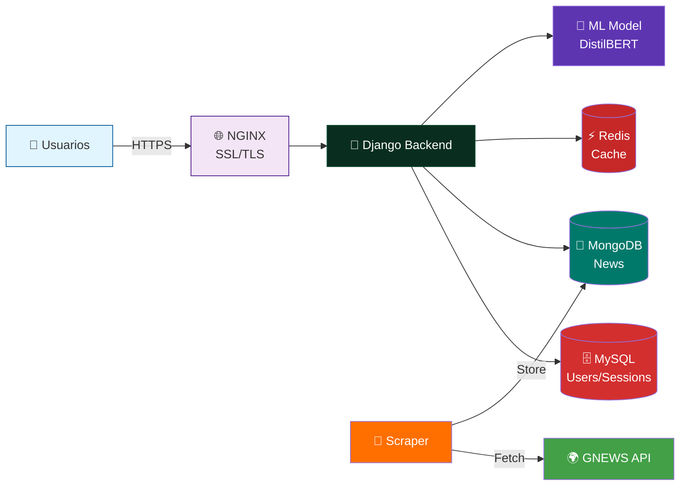

---

## 🏗️ Stack Tecnológico Visual

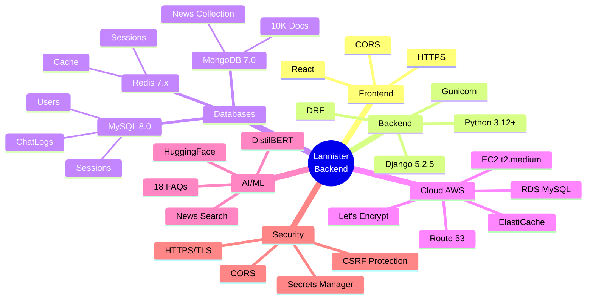

---

## 🔄 Flujo Principal: Usuario Consulta Noticias

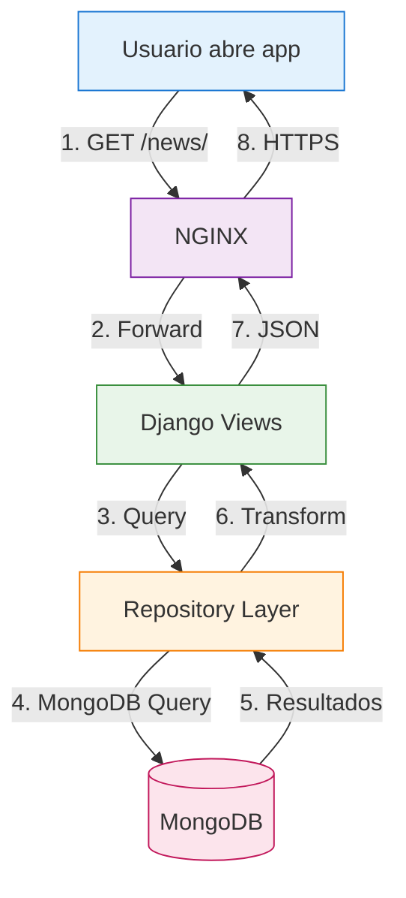

---

## 🤖 Flujo Principal: Chat con Chatbot

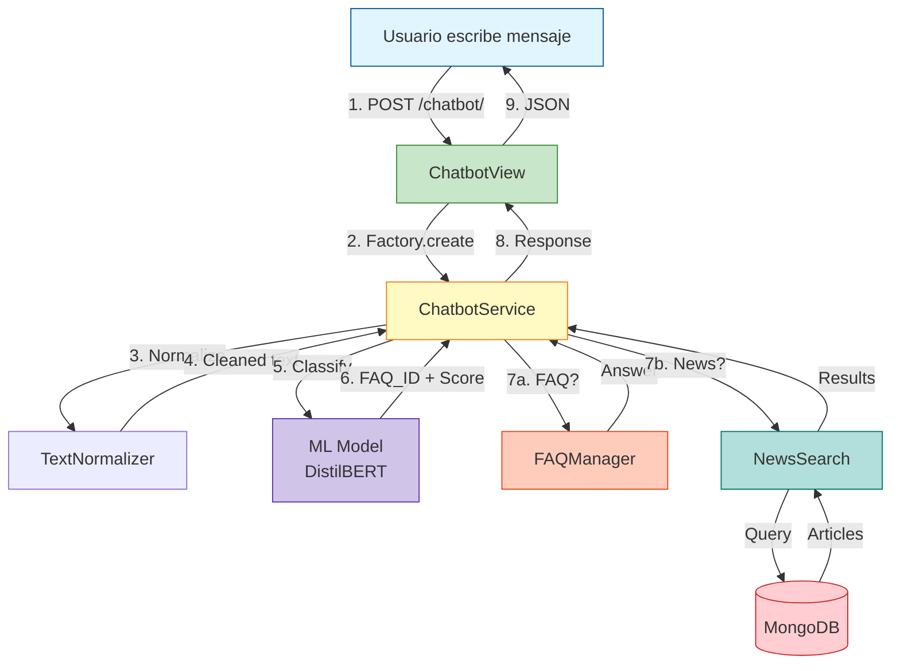

---

## 👤 Flujo Principal: Autenticación de Usuario

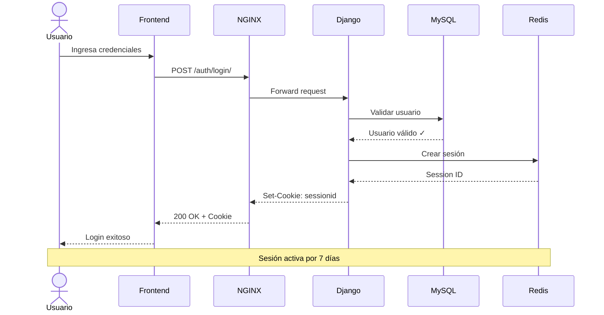

---

## 🌐 Infraestructura AWS - Vista Simplificada

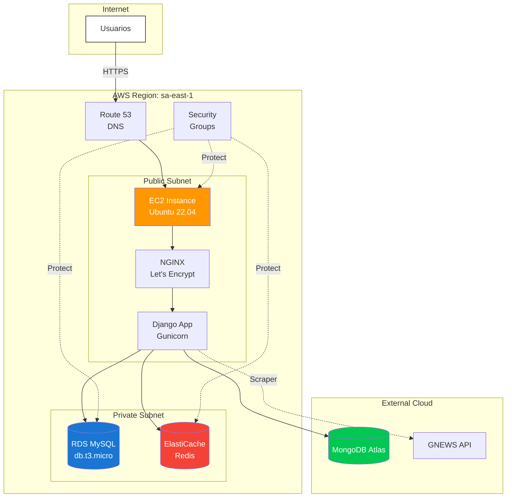

---

## 📊 Modelo de Datos - Relaciones Clave

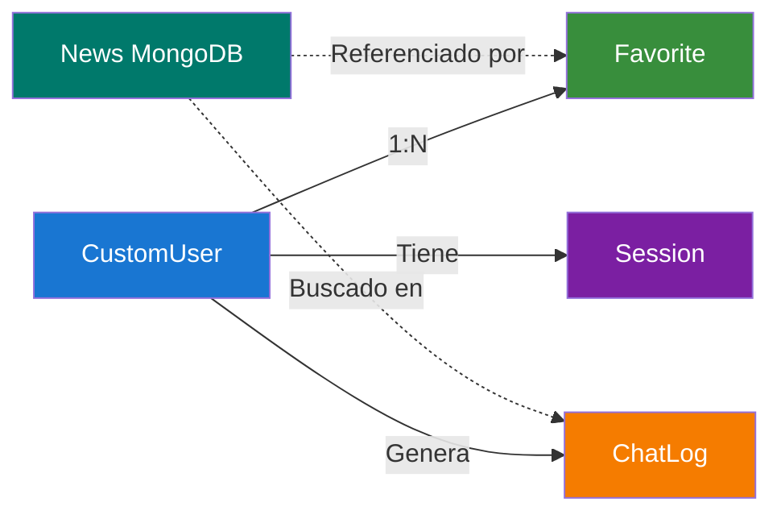

---

## 🎯 Módulos del Sistema

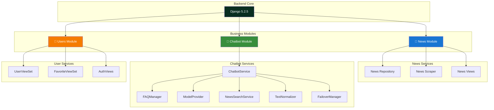

---

## 🔐 Capas de Seguridad

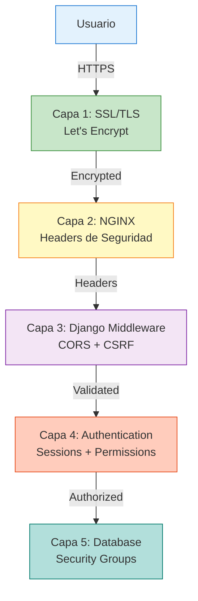

---

## 📈 Escalabilidad: Evolución del Sistema

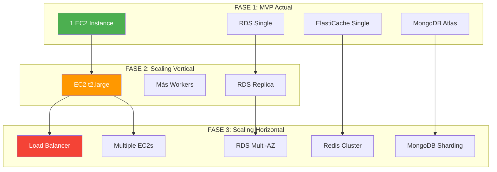

---

## 🧪 Testing Strategy

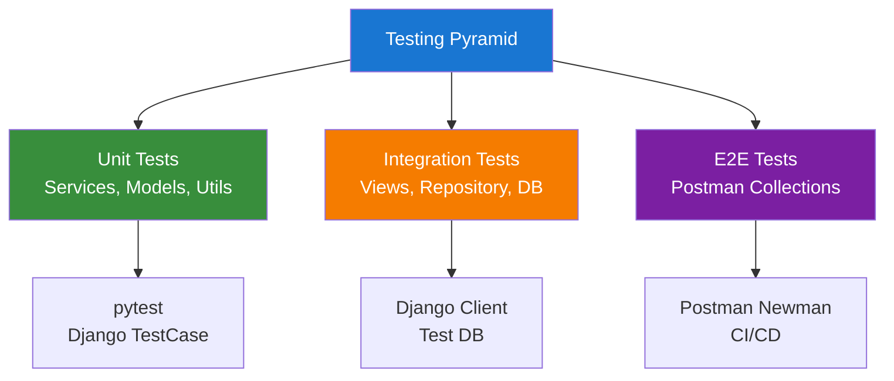

---

## 📊 Monitoreo del Sistema

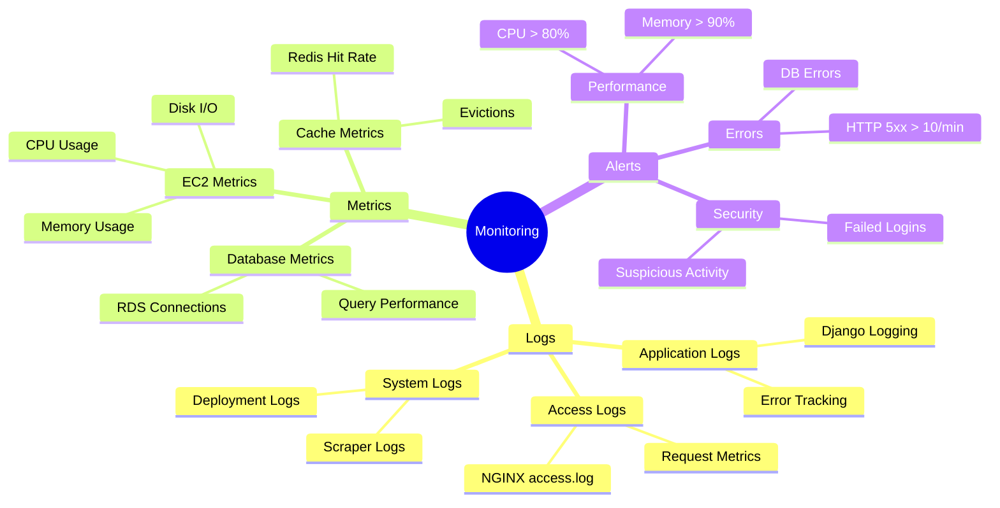

---

## 🎯 Decisiones Arquitectónicas (ADRs)

### 1️⃣ Monolito Modular vs Microservicios
**Decisión:** Monolito modular  
**Razón:** Simplicidad, menos costo, suficiente para escala actual  
**Trade-off:** Menos flexibilidad, pero más fácil de mantener

### 2️⃣ Base de Datos Híbrida
**Decisión:** MySQL + MongoDB  
**Razón:** SQL para relaciones, NoSQL para documentos flexibles  
**Trade-off:** Complejidad, pero mejor performance

### 3️⃣ ML Local vs API Externa
**Decisión:** Modelo local (HuggingFace)  
**Razón:** Sin costo por request, privacidad, latencia < 500ms  
**Trade-off:** 4.4 GB en disco, requiere recursos de servidor

### 4️⃣ Redis para Sesiones
**Decisión:** Redis como session backend  
**Razón:** In-memory > Disk, escalable  
**Trade-off:** Requiere ElastiCache, pero mejora performance

---

**Para más detalles técnicos:**
- [COMPONENT_DIAGRAM.md](./COMPONENT_DIAGRAM.md) - Diagrama completo de componentes
- [ARCHITECTURE_OVERVIEW.md](./ARCHITECTURE_OVERVIEW.md) - Arquitectura detallada

---

**Última Actualización:** 26 de octubre de 2025  
**Ideal para:** Presentaciones, Onboarding Rápido, Revisiones de Arquitectura
